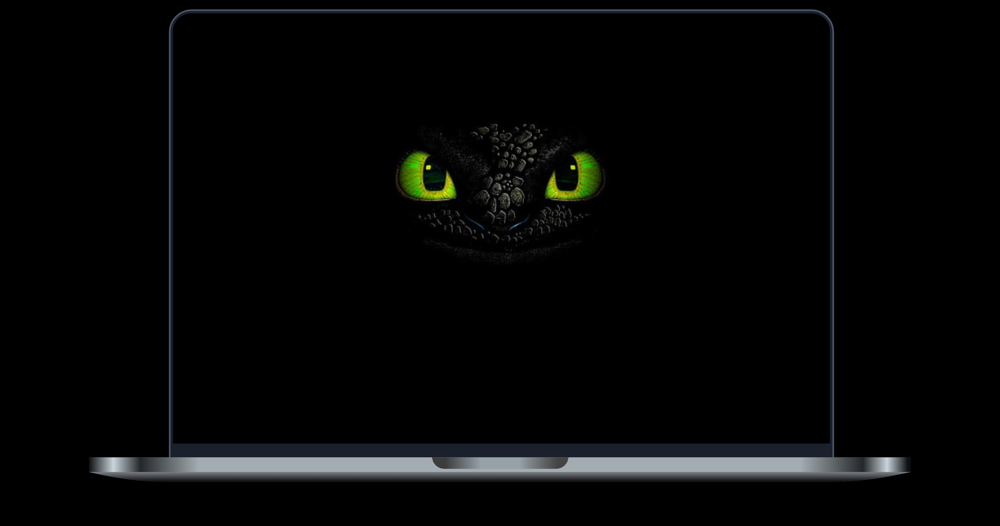
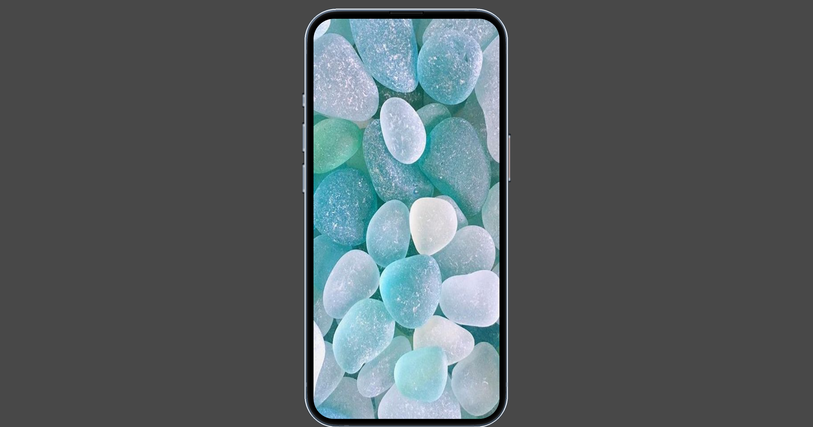

# Device Layouts

Device Layouts is a component that provides responsive layouts for different devices such as laptops and iPhones. It comes with pre-defined CSS styles that are customizable to fit your specific use case.

## Installation

To install this package, run:
```bash
npm install device-layouts
```

## Usage

First, import the `Layouts` component into your project:

```js
import React from "react";
import Layouts from "device-layouts";
```

Then, create your element that you want to display in the layout, for example:
```js
const element = (
  
);
```

Next, use the `Layouts` component to get the different layouts:
```js
const { Iphone, Laptop } = Layouts({ element });
```

You can then use the `Iphone` and `Laptop` components in your app's JSX:

```jsx
return (
  <div>
    <Laptop />
    <Iphone />
  </div>
);
```

---

### Laptop Layout


### Iphone Layout



You can also customize the CSS styles of the layouts by adding new styles or overriding the pre-defined ones.

## CSS Styles

The pre-defined CSS styles are located in `./src/assets/css/style.css` and include the following classes:

- `laptop_layout`
- `iphone_layout`
- `laptop_layout_child`
- `iphone_layout_child`

You can modify these styles to fit your specific use case.

## License

This project is licensed under the **[MIT License](https://github.com/jacksonkasi1/device-layout/blob/main/LICENSE)** - see the LICENSE file for details.

